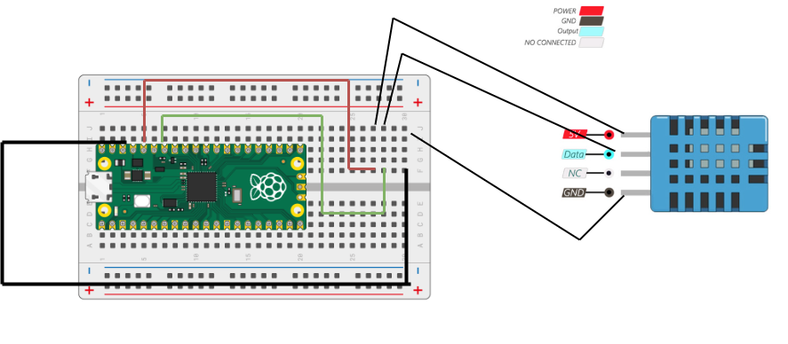
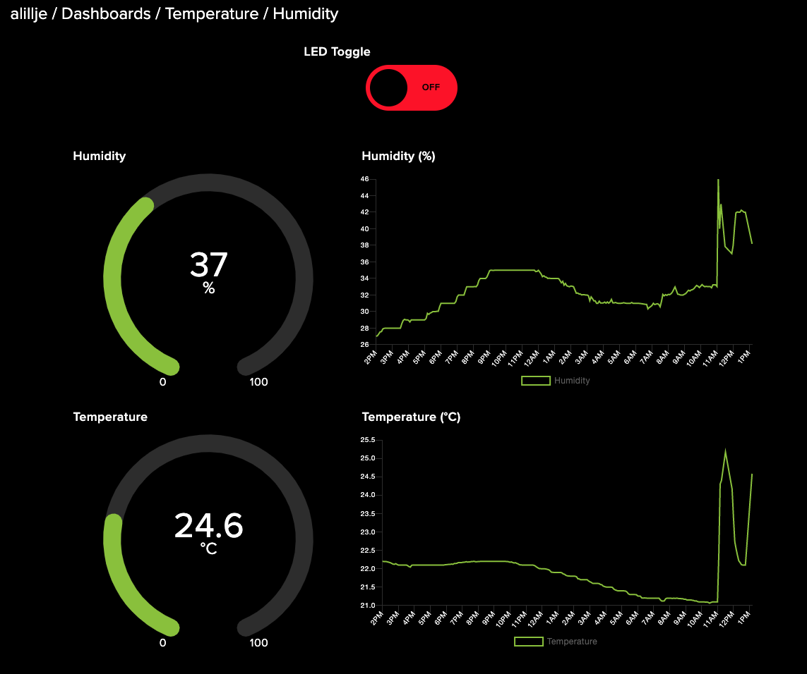

# 1DV027 IoT Project Report
## Andreas Lillje (al225wg)

**Please keep the total length of the tutorial below 25k characters.** You can include code that is linked to a repository. Keep the code snippets in the tutorial short.

## Tutorial on how to build a temperature and humidity sensor

Give a short and brief overview of what your project is about.
What needs to be included:


## **Real time temperature and humidity data**
#### (al225wg)
### **Overview**
In my project, I wanted to be able to measure the temperature and humidity in my house.
I wanted to be able to follow the temperature and humidity in my house in real time.

First, I configured the "thing" (Raspberry PI Pico WH) by connecting it to DHT11 temp/humidity sensor. I then wrote code to connect to wifi and read the measured data.
I sent the data via MQTT to the MQTT broker (Adafruit), where I have set up different feeds/topics related to the temperature and humidity data. From my device i then publish the data via MQTT to the MQTT broker. 

From these feeds, I can visualize the data in real time on Adafruit Dashboards. I also set up a feed that my Raspberry PI Pico WH subscribes to. It listens for "on" and "off" messages. Depending on the message, it turns the LED on or off. The

Furthermore, I have also created a web application that displays current temperature and humidity in my house. I have written and deployed a web server in .NET/C#, that utilize the Adafruit API via HTTP in order to get the latest data. Following that, I created a user interface that communicates with my web server via HTTP in order to retrieve the latest data, and display it to the end user. 

This has taken 1 - 2 weeks to achieve. I first made the mistake by sending the data directly from the device via HTTP to the web server, which led to extra work. However, it increased my understanding of the concept and I got to pracitce writing Python (Micropyhton)

### Objective

I chose this project as my first step into the world of Internet of Things (IoT) because I wanted something simple and useful. The goal was to make a device that could tell me the temperature and humidity in my house in real time.

The device I built is helpful because it keeps an eye on the temperature and humidity conditions inside my home. This data is handy for making sure my home is comfortable for everyone living in it. It can also help to use energy more efficiently by adjusting heating or cooling based on the actual conditions inside.

By showing the data on a web application I built, I can see the current conditions from any where in a web broser. In other words, I can pick up my phone from the other side of the world and keep track of the current conditions in my home. 

In summary, this project gave me a chance to learn about IoT while creating a tool that helps me to maintain a comfortable home.

### Material

Explain all material that is needed. All sensors, where you bought them and their specifications. Please also provide pictures of what you have bought and are using.

| Material | Image | Specifications | Purpose | Cost | Store |
|---|---|---|---|---|---|
| [Raspberry Pi Pico WH](https://www.electrokit.com/produkt/raspberry-pi-pico-wh/) | Fig 1 | RP2040 CPU, ARM Cortex-M0+ 133MHz, 256kB RAM, 30 GPIO pins, 2MB on-board QSPI Flash, CYW43439 wireless chip, IEEE 802.11 b/g/n wireless LAN | This is the main controller for the project. It has WiFi capabilities and can be programmed to interact with the other components. | 109.00 SEK | Electrokit |
| [Kopplingsdäck 840 anslutningar](https://www.electrokit.com/produkt/kopplingsdack-840-anslutningar/) | Fig 2 | High-quality breadboard with 840 connections. Hole distances are 2.54mm. | This is used to connect the different components of the project without soldering. | 69.00 SEK | Electrokit |
| [Labbsladd 20-pin 15cm hane/hane](https://www.electrokit.com/produkt/labbsladd-20-pin-15cm-hane-hane/) | Fig 3 | 20-pin lab cable with connectors at both ends for breadboards and pin / socket strips. | This is used to connect the different components on the breadboard. | 29.00 SEK | Electrokit |
| [Temp/fuktsensor – DHT11](https://www.electrokit.com/produkt/temp-fuktsensor-dht11/) | Fig 4 | Working voltage: 3 – 5VDC, Power consumption: 0.5 – 2.5mA, Measurable range: 20 – 80% RH, Operating temperature: 0 to +50°C, Accuracy (RH): ±5%, Accuracy (temp): ±2°C | This sensor is used to measure both temperature and humidity. It is calibrated and only needs an external pull-up resistor of ~5kohm. | 39.00 SEK | Electrokit |

- In this project, I chose to use the Raspberry Pi Pico WH as the main controller due to its powerful RP2040 CPU and built-in WiFi capabilities. 

- The Kopplingsdäck 840 anslutningar, or breadboard, I selected because it allows for easy assembly and disassembly of the components.

- The Labbsladd 20-pin 15cm hane/hane is used to establish connections between the different components on the breadboard. Its compatibility with breadboards and pin/socket strips makes it a practical choice for this project

- The DHT11 temperature and humidity sensor was chosen for its ability to measure both temperature and humidity with reasonable accuracy. 

### Computer setup

**Installation of Thonny IDE:** I installed Thonny as a native application on my computer. Thonny is a Python IDE for beginners, which makes it easy to get started with programming.

**Installation of Packages:** To install packages, such as the mqtt.simple package on the device, I used Thonny's built-in "Plug-in manager". This made the installation process straightforward and easy.

**Flashing MicroPython on the Device:** After installing Thonny, I connected my device to the computer. I then installed MicroPython on it using the built-in installation tools in the Thonny IDE. Flashing in this context means writing the MicroPython firmware to the device's memory.

**Creating and Saving Python Files:** I created Python files and saved them directly on the device. This was made simple using Thonny, as it provides the option to choose where to save the files just by clicking "save".

**Setting up the main.py File:** I have a main.py file and some other modules that main.py depends on. The main code is in main.py, which is the code that runs automatically when the device gets plugged into power. In this file, I set up the WiFi connection, configured MQTT, and connected to the MQTT server.

**Running the Loop:** I set up a loop that first checks if anything has been published by the subscribed topics, then reads the temperature and humidity measurements, formats the data into strings, and publishes the data to the corresponding topic. The loop then waits for 5 seconds before repeating the process. This is because the rate limit is restricted for free Adafruit accounts (Adafruit is the MQTT broker I used).

**Exception Handling:** If an exception occurs, it is handled in the exception block which prints the error (if in development) and then continues the loop to go through the process again.

**Version Control with Git:** Unfortunately, I did not figure out how to version control the code from the Thonny IDE with Git. To resolve this, I created a repository in another IDE, Visual Studio Code, that contains the same code. When I update the code in Thonny, I duplicate it into my Visual Studio Code project and make a commit. I understand that this is not an optimal way, but this is how it played out this time. This approach ensures that I have a backup of the code and can track changes over time, even though it's a bit more manual than I'd like. In the future, I plan to explore better ways to integrate version control directly into my workflow with Thonny.


### Putting everything together

#### **Circuit Diagram**


The fourth PIN on the DHT11 is not used. 

The DHT11 sensor is connected to the Raspberry Pi Pico WH as follows:

**Ground Pin:** The Ground pin of the DHT11 sensor is connected to Pin 38 of the Raspberry Pi Pico WH, which is a Ground pin. This establishes a common ground between the sensor and the Raspberry Pi.

**Power Pin:** The Power pin of the DHT11 sensor is connected to a 3.3V Out pin on the Raspberry Pi Pico WH. This provides the necessary power for the DHT11 sensor to operate.

**Data Pin:** The Data pin of the DHT11 sensor is connected to Pin 34 on the Raspberry Pi Pico WH, which corresponds to GP28. This is the pin through which the Raspberry Pi Pico WH and the DHT11 sensor communicate.

It's important to note that the DHT11 sensor operates at a voltage of 3 to 5V, so the 3.3V supplied by the Raspberry Pi Pico WH is within this range. Also, the DHT11 sensor has a built-in resistor, so there's no need for an additional resistor in this setup.

This setup is suitable for a development environment. However, for a production environment, you might want to consider a more robust connection method than a breadboard, such as soldering the connections or using a printed circuit board (PCB). Also, in a production environment, you would want to consider factors such as power management, error handling, and enclosure design to protect the electronics.

### Platform

#### **Data Visualization**
Once the data is sent to Adafruit, I can visualize it in real time using Adafruit Dashboards. This is a cloud-based service that allows me to create custom dashboards to display my sensor data. I also set up a feed that my Raspberry Pi Pico WH subscribes to, allowing it to listen for "on" and "off" messages and control an LED accordingly.

#### **Web Application**
In addition to the Adafruit Dashboards, I also created a web application to display the current temperature and humidity in my house. I wrote a web server in .NET/C# that uses the Adafruit API to retrieve the latest sensor data. I then created a user interface that communicates with my web server to display this data to the end user. The web server is hosted on an Ubuntu virtual machine provided by my school, and the web application is hosted on Netlify.

#### **Choice of Platform**
I chose these platforms because they provided the functionality I needed and were relatively easy to use. I initially tried sending the data directly from the device to the web server via HTTP, but this proved to be more work than necessary. By using MQTT and Adafruit, I was able to simplify the data transmission process and focus on the core functionality of my project.

Currently, I'm using the free tier of Adafruit's MQTT service. If I were to scale this project in the future, I might consider upgrading to a paid subscription to get access to more features and higher data limits. However, the free tier is sufficient for my current needs.

### The code

Import core functions of your code here, and don't forget to explain what you have done! Do not put too much code here. Focus on the core functionalities. Have you done a specific function that does a calculation, or are you using a clever function for sending data on two networks? Or, are you checking if the value is reasonable, etc.? Explain what you have done, including the setup of the network, wireless, libraries and all that is needed to understand.

```python=

# main.py

def handle_incoming_messages(topic, msg):
    topic = topic.decode('utf-8')
    msg = msg.decode('utf-8')
    if topic == mqtt_subscribe_topic_led:
        if msg == "on":
            led.value(1)
        elif msg == "off":
            led.value(0)


# This function is used to handle incoming MQTT messages. It checks if the received message is an "on" or "off" command for the LED. If it is, it turns the LED on or off accordingly. This allows you to control the LED remotely via MQTT.

    except Exception as e:
        print(f'Failed to publish message: {e}')
    continue

# The except Exception as e: line catches any type of exception. By doing this, it prevents the program from crashing when an error occurs. Instead, it prints an error message to the console and then continues the execution of the program.
```

```python=

# wifi_connector.py
```python
import network
import urequests

# The script begins by importing two modules: network and urequests. The network module is used to configure the WiFi connection, while urequests is used to make HTTP requests to test the internet connection.

def connect_to_network(ssid, password):

# The connect_to_network function is defined with two parameters: ssid and password. These are the credentials for the WiFi network that the device will connect to.

wlan = network.WLAN(network.STA_IF)
wlan.active(True)

# A WLAN object is created and activated. network.STA_IF indicates that the device should operate as a station (i.e., a client) in the network.

if wlan.isconnected():
    print("Already connected to a network.")
    response = urequests.get("http://www.google.com")
    if response.status_code == 200:
        print("Internet connection successful!")
    else:
        print("Failed to connect to Google. Please check your internet connection.")
    return

# The script checks if the device is already connected to a network. If it is, it makes an HTTP GET request to Google to test the internet connection. If the status code of the response is 200, it means the request was successful, and the internet connection is working. If not, an error message is printed.

```

There is more code to explain. I have left plenty of comments in the original source code to explain and motivate the execution.


### Data flow / Connectivity

In this project, the data is transmitted from the Raspberry Pi Pico WH to the Adafruit MQTT broker over the internet. Here's a detailed explanation of the process:

#### **Data Collection**: The DHT11 sensor measures the temperature and humidity. This data is then read by the Raspberry Pi Pico WH using the MicroPython code.

#### **Wireless Protocol**: The Raspberry Pi Pico WH is connected to a WiFi network. WiFi was chosen as the wireless protocol due to its widespread availability, high data rates, and sufficient range for this indoor application.

#### **Data Transmission Frequency**: The data is sent every 5 seconds. This frequency was chosen as a balance between providing real-time updates and conserving power.

#### **Transport Protocol**: The data is sent using MQTT (Message Queuing Telemetry Transport), a lightweight messaging protocol designed for devices with limited processing power and low-bandwidth, high-latency networks. MQTT was chosen for its simplicity, efficiency, and reliability.

#### **Data Format**: The temperature and humidity data is converted into strings and published as separate messages to the MQTT broker. Each message contains the topic (either "temperature" or "humidity") and the corresponding measurement.

Server: The MQTT broker used is provided by Adafruit. It's a cloud-based service that receives the MQTT messages and makes the data available for real-time visualization on Adafruit Dashboards.

Information Model: There isn't a specific information model used in this project like WoT TD or Fiware. The data is simply sent as raw sensor readings.

The choice of WiFi and MQTT was primarily driven by their suitability for this application. WiFi provides a reliable and high-speed connection for indoor use, and MQTT is a lightweight and efficient protocol that's well-suited for IoT applications.

### Presenting the data
#### **Adafruit Dashboard**



The Dashboard is build by creating blocks in the Adafruit IO Dashboards section. When creating a block you select the feed you want to visualize. 
I chose to visualize the temperature and humidity in graphs for the last 24 hours. I also added a widget that displays the latest recorded temperature and humidity, presentating the current conditions. 

Adafruit IO acts as the database in this setup. It's a time-series database, which is ideal for IoT applications where data is often timestamped. The choice of Adafruit IO simplifies the setup as it provides both the MQTT broker and the database in one service. The data is stored in the Adafruit IO cloud. With the free plan, data is stored for 30 days.


### Finalizing the design

Show the final results of your project. Give your final thoughts on how you think the project went. What could have been done in another way, or even better? Some pictures are nice!

- [ ] Show the final results of the project
- [ ] Pictures
- [ ] Video presentation of the project